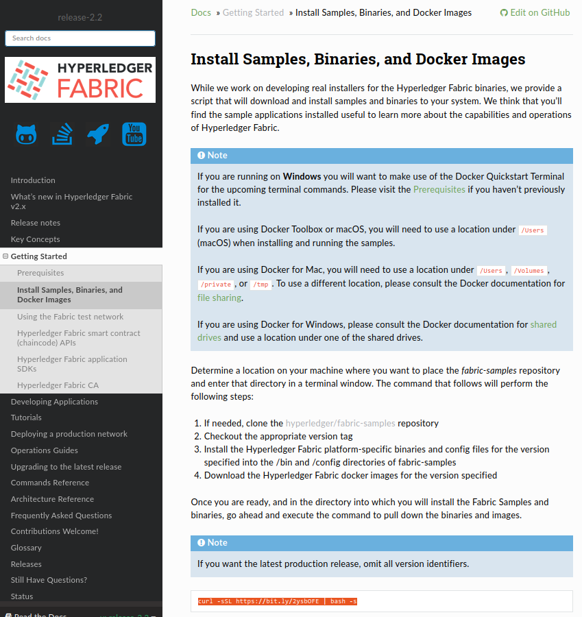

# Инструкция по поднятию сети HyperLedger Fabric с тремя организациями в ней

0. Создать папку проекта

1. Скачать репозиторий HyperLedger Fabric Samples (fabric-samples) через специальный скрипт, указанный в официальной документации в разделе **Getting Started**/**Install Samples, Binaries, and Docker Images**

    * Для запуска скрипта зайдите в терминал, перейдите в каталог, в который вы хотите сохранить `fabric-samples` (**не папка проекта**) с помощью `cd` и введите скрипт, указанный на сайте - он создаст каталог `fabric-samples`

2. Из полученного каталога `fabric-samples` скопируйте в папку с проектом:
    1. `bin`
    2. `test-network/configtx/configtx.yaml`
    3. `test-network/compose/compose-test-net.yaml`
    4. `test-network/compose/compose-ca.yaml`

3. Измените `configtx.yaml` по [инструкции](configtx.yaml) (для сравнения используйте файл `configtx.yaml` который мы получили из `fabric-samples/test-network/configtx`)

4. Создайте файл `docker-compose.yml` и заполните его согласно [инструкции](docker-compose.yml)

5. Создайте файлы `ca-start1.sh`, `ca-start2.sh`, `start1.sh`, `start2.sh` и заполните их согласно тем файлам, что вы найдете в этой документации
   * **ВСЕ СКРИПТЫ НУЖНО ИСПОЛНЯТЬ ОТ ИМЕНИ ROOT** - для этого перед командой нужно написать `sudo`

6. На **первом** компьютере выполните следующие команды:
   1. `chmod +x *.sh` - помечает все наши скрипты как доступные к исполнению
   2. `./ca-start1.sh` - выполняет инициализацию всех центров сертификации (CA - Certificate Authority) и создаёт необходимые сертификаты для организаций Orderer и Users
   3. `chown <имя текущего пользователя>:<имя текущего пользователя> -R ./` - передаёт владение текущей папкой и всеми подпапками нашему пользователю, чтобы мы могли переносить файлы с нашего компьютера на другой

7. Скопируйте все файлы из папки на второй компьютер (через сетевую папку или через SFTP)

8. На **втором** компьютере выполните следующие команды:
   1. `./ca-start2.sh` - выполняет инициализацию всех центров сертификации (CA - Certificate Authority) и создаёт необходимые сертификаты для организаций Shops и Bank
   2. `chown <имя текущего пользователя>:<имя текущего пользователя> -R ./` - передаёт владение текущей папкой и всеми подпапками нашему пользователю, чтобы мы могли переносить файлы с нашего компьютера на другой

9. Скопируйте все файлы из папки на первый компьютер (через сетевую папку или через SFTP)

10. На первом компьютере запустите скрипт `start1.sh`

11. Скопируйте все файлы из папки на второй компьютер

12. На втором компьютере запустите скрипт `start2.sh`
